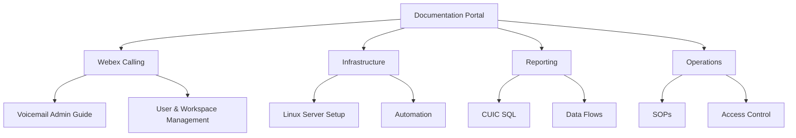

# Administration Documentation Portal

Welcome to the unified administration portal.  
This site provides structured, engineer‑ready documentation for **Webex Calling**, **Voicemail**, **Infrastructure**, **Automation**, and **Operational Procedures**.

---

## 📁 Main Documentation Areas

-   ### 📞 Webex Calling
    **Core collaboration platform documentation**
    - Voicemail Admin Guide  
    - User & Workspace Management  
    - Call Queues, Hunt Groups, Auto Attendants  
    - Schedules & Holidays  
    **→ [Open Webex Calling Docs](webex-calling/)**

-   ### 🛠 Infrastructure & Automation
    **Backend systems and automation**
    - Linux server configuration  
    - Systemd services  
    - SFTP chroot  
    - File Browser deployment  
    - CI/CD & automation tooling  
    **→ [Open Infrastructure Docs](infrastructure/)**

-   ### 📊 Reporting & Analytics
    **CUIC / UCCE reporting resources**
    - SQL queries  
    - Custom report definitions  
    - Data flow diagrams  
    - Troubleshooting  
    **→ [Open Reporting Docs](reporting/)**

-   ### 📚 Operational Procedures
    **Standard operating procedures**
    - Incident response  
    - Change management  
    - Backup & restore  
    - Access control  
    **→ [Open SOPs](operations/)**

---

## 🧭 Quick Navigation Map

