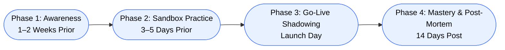

# Webex Attendant Console (WxAC) – Operator Training Guide

## 1. CUAC → WxAC Delta Overview

### Interface Changes

- **What Changed**
  - WxAC is embedded inside the **Webex App**, not a standalone desktop program  
  - No more CUAC server IP logins  
  - Cleaner, cloud-native layout  
  - Automatic updates with Webex App  

- **Operator Impact**
  - Faster access  
  - No separate application to launch  
  - Reduced workstation dependency  
  - Familiar Webex UI reduces training time  

---

### Layout Mapping

- **CUAC → WxAC Mapping**
  - Call Control → Call Control Bar  
  - Directory Pane → Smart Directory  
  - Queue Pane → Queue Panel  
  - Speed Dials → Unlimited Favorites  

- **Details**
  - Panels are collapsible  
  - Directory search is significantly faster  
  - Favorites can be grouped without limits  
  - Presence indicators are richer and cloud-based  

---

## 2. Cloud-Native Call Handling

### Drag-and-Drop Transfers

- **Steps**
  1. Answer the call  
  2. Drag the call bubble  
  3. Drop anywhere on the contact row  
  4. Webex determines the correct transfer type  

- **Details**
  - No more “Consult” vs “Direct Transfer” boxes  
  - Reduces operator hesitation  
  - Works with Favorites, Directory, and Queues  
  - Ideal for high-volume environments  

---

### Dynamic Call Parking

- **Steps**
  1. Click **Park**  
  2. Webex assigns the next available slot  
  3. Communicate the slot number  
  4. Retrieve from any device  

- **Details**
  - No manual slot selection  
  - Prevents collisions  
  - Faster than CUAC parking  
  - Recommended for reception desks  

---

### Keyboard Shortcut Delta

- **CUAC Shortcuts**
  - F10 – Answer  
  - F11 – Transfer  
  - F12 – Hold  
  - F9 – End  

- **WxAC Shortcuts**
  - Ctrl + Shift + A – Answer  
  - Ctrl + Shift + T – Transfer  
  - Ctrl + Shift + H – Hold  
  - Ctrl + Shift + E – End  

---

## 3. Presence & Smart Directories

### Calendar Presence

- **What You See**
  - Busy  
  - In a meeting  
  - Out of office  
  - Free  

- **Details**
  - Prevents blind transfers  
  - Uses Microsoft 365 / Outlook presence  
  - Works across the entire organization  
  - Reduces call bouncing  

---

### Smart Directory Search

- **Search Capabilities**
  - Name  
  - Department  
  - Role  
  - Keywords  
  - Team names  

- **Details**
  - Faster than CUAC  
  - Supports partial matches  
  - Ideal for large organizations  
  - Operators no longer need exact spelling  

---

### Unlimited Favorites

- **Best Practices**
  - Group by department  
  - Add external numbers  
  - Keep top 10 most-used contacts at the top  
  - Use Favorites for high-volume transfers  

- **Details**
  - No CUAC speed-dial limits  
  - Drag-and-drop compatible  
  - Supports custom ordering  
  - Ideal for reception and switchboard teams  

---

## 4. Training Strategy (4‑Phase Rollout)

### Mermaid Diagram

## Phase 1 — Awareness
• Steps
	◦ Share a 5-minute intro video
	◦ Highlight quick wins
	◦ Explain cloud-native benefits
• Details
	◦ Reduces anxiety
	◦ Builds curiosity
	◦ Sets expectations early
---
## Phase 2 — Sandbox Practice
• Steps
	◦ Create a Training Queue
	◦ Pair operators
	◦ Practice transfers, parking, directory search
• Details
	◦ No customer impact
	◦ Builds muscle memory
	◦ Encourages peer learning
---
## Phase 3 — Go-Live Shadowing
• Steps
	◦ Trainer sits with operators
	◦ Or stays in a Webex meeting
	◦ Provide instant troubleshooting
• Details
	◦ Reduces first-day mistakes
	◦ Builds confidence
	◦ Ensures smooth launch
---
## Phase 4 — Mastery & Post-Mortem
• Steps
	◦ 15-minute follow-up
	◦ Review Favorites usage
	◦ Optimize shortcuts
	◦ Adjust layout
• Details
	◦ Eliminates bad habits
	◦ Improves long-term efficiency
	◦ Uses real call volume data