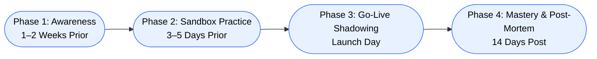

# Operator Transition Training — CUAC to Webex Attendant Console (WxAC)

This page provides a complete, operator‑focused transition guide for moving from the legacy **Cisco Unified Attendant Console (CUAC)** to the modern, cloud‑native **Webex Attendant Console (WxAC)**.  
It includes the educational vision behind the training, the delta‑focused learning content, and a visual Mermaid diagram of the rollout strategy.

---

## 🎯 Training Purpose

Operators already know how to handle calls.  
This training focuses exclusively on:

- What is *different*  
- What is *new*  
- What is *no longer applicable*  
- What workflows have been *simplified or automated*  

---

# 🌱 Educational Vision & Training Philosophy

Transitioning operators from CUAC to WxAC is not just a technical migration — it is a **behavioral change process**.  
Our training strategy is built on three core principles of adult learning:

## 1. Reduce Cognitive Load
We avoid re-teaching telephony basics and focus only on the delta between CUAC and WxAC.

## 2. Build Confidence Before Competence
Operators must feel safe before they can perform well.  
Early exposure reduces fear and creates curiosity.

## 3. Learn by Doing
Hands-on practice builds muscle memory.  
Operators master drag‑and‑drop transfers, dynamic parking, and directory search through repetition.

---

# 🗺️ Training Rollout Strategy (Mermaid Diagram)

Phase 1 — Awareness
• Steps
	◦ Share a 5-minute intro video
	◦ Highlight quick wins
	◦ Explain cloud-native benefits
• Details
	◦ Reduces anxiety
	◦ Builds curiosity
	◦ Sets expectations early
---
Phase 2 — Sandbox Practice
• Steps
	◦ Create a Training Queue
	◦ Pair operators
	◦ Practice transfers, parking, directory search
• Details
	◦ No customer impact
	◦ Builds muscle memory
	◦ Encourages peer learning
---
Phase 3 — Go-Live Shadowing
• Steps
	◦ Trainer sits with operators
	◦ Or stays in a Webex meeting
	◦ Provide instant troubleshooting
• Details
	◦ Reduces first-day mistakes
	◦ Builds confidence
	◦ Ensures smooth launch
---
Phase 4 — Mastery & Post-Mortem
• Steps
	◦ 15-minute follow-up
	◦ Review Favorites usage
	◦ Optimize shortcuts
	◦ Adjust layout
• Details
	◦ Eliminates bad habits
	◦ Improves long-term efficiency
	◦ Uses real call volume data